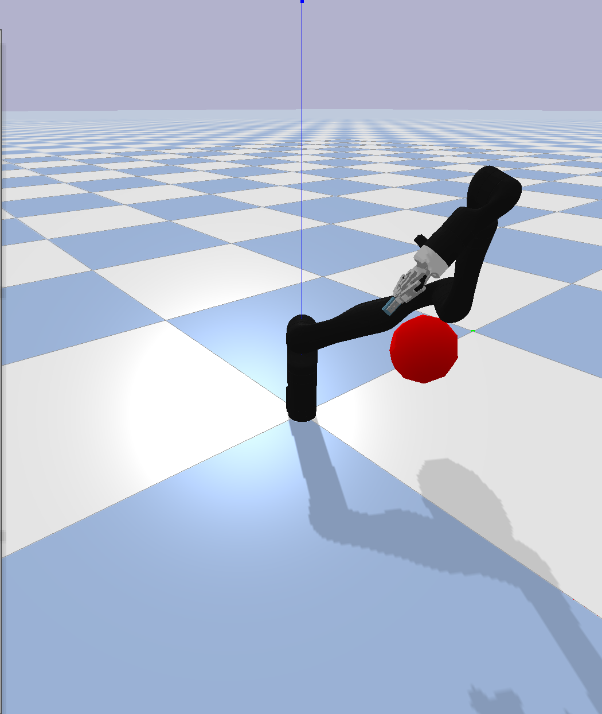
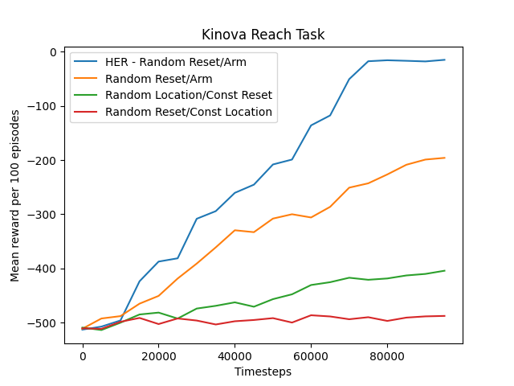

# Gym-Styled Kinova arm with Robotiq UR5 gripper

Originally forked off of
[ElectronicElephant's UR5 package](https://github.com/ElectronicElephant/pybullet_ur5_robotiq)
,heavily adapted for my own purposes.

## Kinematic Model Of Kinova Arm
This repository trains and tests the effectiveness of a Kinova arm performing a reach task with 4 different methods. The first two methods involve randomly resetting the arm configuration and reach location respectively with a PPO policy. The next method resets both the arm location and reach location randomly during during training with a PPO policy. The last method also uses a random arm and reach location but now uses a HER policy.

Implementation and results of training the arm:

